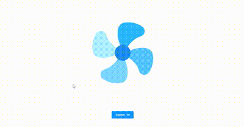

# Fan with Speed Button

This project demonstrates a simple fan animation with adjustable speed using HTML, CSS, and JavaScript. The fan's speed can be controlled by clicking a button, cycling through different speed levels.

## Getting Started

### Prerequisites

- A modern web browser that supports CSS animations and JavaScript.

### Running the Fan Animation

1. Save the `index.html`, `style.css`, and `script.js` files to your local machine.
2. Open the `index.html` file in your web browser.

## Features

- Animated fan blades that spin continuously.
- A button to adjust the speed of the fan blades.
- Speed ranges from 1 to 10, displayed on the button.

## HTML Structure

- The HTML file contains a `div` with the class `fan` that holds the fan blades.
- The fan blades are represented by a `div` with the class `blades`.
- A button with the ID `speedButton` allows users to change the speed of the fan.

## CSS Styling

- The `style.css` file includes styles for the fan and its blades.
- CSS animations are used to create the spinning effect of the fan blades.
- The animation duration is adjusted dynamically based on the speed.

## JavaScript Functionality

- The `script.js` file contains the logic to handle the speed adjustment.
- The speed of the fan blades is controlled by modifying the `animation-duration` property.
- The button's text updates to reflect the current speed level.

## How to Use

1. Open the `index.html` file in your web browser.
2. Click the `Speed` button to increase the speed of the fan blades.
3. The speed will cycle from 1 to 10, then reset to 1.

## Notes

- Ensure the `style.css` and `script.js` files are located in the same directory as the `index.html` file for proper functionality and styling.

Enjoy experimenting with the adjustable fan speed animation!

### Out Put
